# Лабораторная работа №3. Облачные сети. Amazon VPC

- **ФИО:** Voronetchii Stanislav
- **Группа:** IA2404
- **Специальность:** Informatica Aplicata
- **Номер `k`:** 77, значит `X = 77 % 30 = 17`, диапазон VPC `10.17.0.0/16`
- **Уровень:** продвинутый
- **Репозиторий:** https://github.com/sta5on-cloud/timecapsule
- **Вариант задания 13.3:** B (скрипты [`scripts/nat-up.sh`](../../scripts/nat-up.sh) и [`scripts/nat-down.sh`](../../scripts/nat-down.sh))
- **Отчёт ЛР2:** [README.md](../../README.md)

> Ресурсы созданы в регионе `eu-north-1` (Stockholm), как и в ЛР2, поэтому зоны доступности называются `eu-north-1a` и `eu-north-1b`, а не `eu-central-1a` и `eu-central-1b`.

## Базовый уровень

### Задание 1. План адресов

| Подсеть     | Зона доступности | Диапазон        | Первый и последний адрес, доступный экземплярам | Сколько адресов доступно экземплярам |
| ----------- | ---------------- | --------------- | ----------------------------------------------- | ------------------------------------ |
| `public-a`  | `eu-north-1a`    | `10.17.0.0/24`  | `10.17.0.4` - `10.17.0.254`                     | 251                                  |
| `public-b`  | `eu-north-1b`    | `10.17.1.0/24`  | `10.17.1.4` - `10.17.1.254`                     | 251                                  |
| `private-a` | `eu-north-1a`    | `10.17.10.0/24` | `10.17.10.4` - `10.17.10.254`                   | 251                                  |
| `private-b` | `eu-north-1b`    | `10.17.11.0/24` | `10.17.11.4` - `10.17.11.254`                   | 251                                  |

**Почему доступных адресов не 256? Какие адреса подсети `10.X.0.0/24` занимает AWS и для чего? Сколько ещё подсетей `/24` поместится в вашу VPC?**
AWS резервирует в каждой подсети пять адресов: `.0` - адрес сети, `.1` - виртуальный маршрутизатор VPC, `.2` - DNS-сервер VPC, `.3` - резерв на будущее, `.255` - широковещательный адрес (в VPC не поддерживается, но тоже зарезервирован). Поэтому из 256 адресов остаётся 251. В VPC `/16` помещается 256 подсетей `/24`, четыре уже созданы, значит можно добавить ещё 252.

### Задание 2. VPC и подсети

**Является ли подсеть `public-a` сейчас публичной? Почему?**
Нет. Публичной подсеть делает не название, а маршрут `0.0.0.0/0` в Internet Gateway. Сразу после создания подсеть связана с основной таблицей маршрутов, где есть только локальный маршрут VPC, поэтому выхода в интернет у неё ещё нет.

### Задание 3. Internet Gateway и таблицы маршрутов

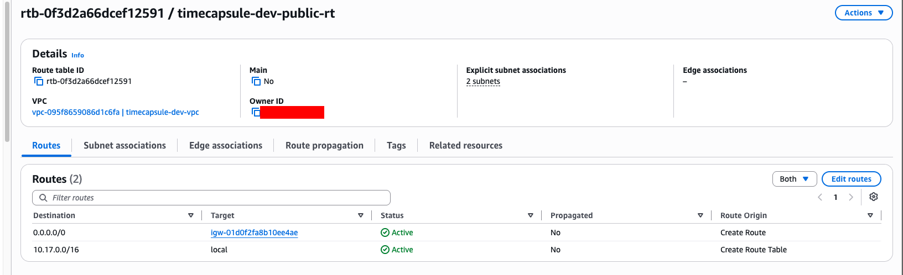

`timecapsule-dev-public-rt`: маршрут `0.0.0.0/0` в Internet Gateway `igw-01d0f2fa8b10ee4ae` и локальный маршрут `10.17.0.0/16`.

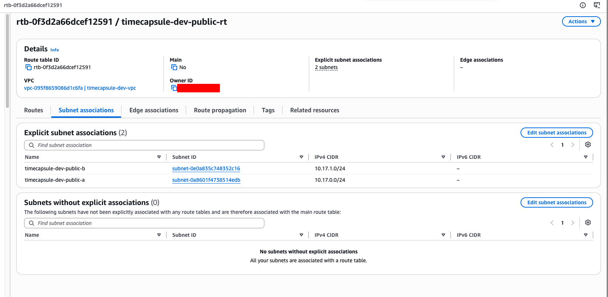

`public-rt` связана с подсетями `public-a` и `public-b`.

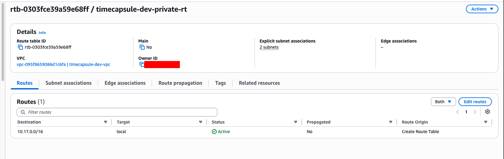

`timecapsule-dev-private-rt`: только локальный маршрут `10.17.0.0/16`, выхода в интернет нет.

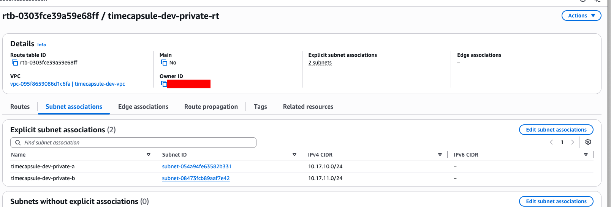

`private-rt` связана с подсетями `private-a` и `private-b`.

**Какой маршрут есть в обеих таблицах, хотя вы его не добавляли? Что он даёт? Куда уйдёт пакет из `private-a`, адресованный `8.8.8.8`?**
В обеих таблицах есть локальный маршрут `10.17.0.0/16 → local`, AWS добавляет его сам. Он даёт связь между всеми подсетями VPC, в том числе между зонами. Пакет на `8.8.8.8` из `private-a` никуда не уйдёт: подходящего маршрута нет, и пакет будет отброшен.

### Задание 4. Security Group

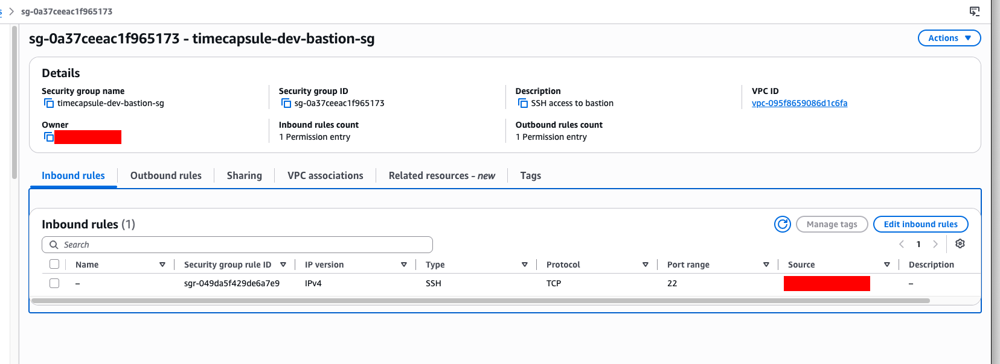

`timecapsule-dev-bastion-sg`: входящее правило SSH (22) только с моего IP (закрыт).

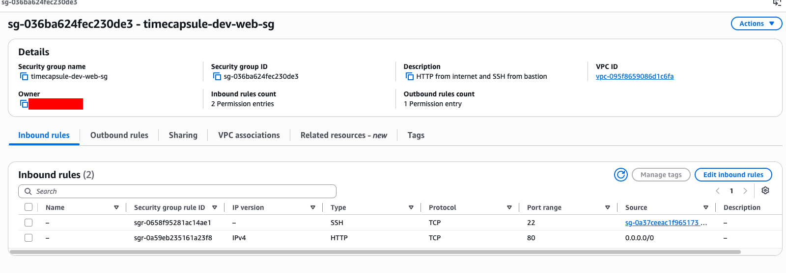

`timecapsule-dev-web-sg`: SSH (22) только от `bastion-sg` и HTTP (80) от `0.0.0.0/0`.

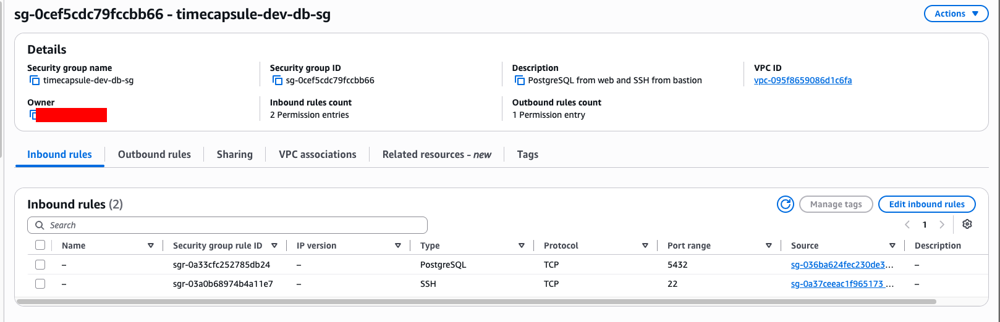

`timecapsule-dev-db-sg`: PostgreSQL (5432) только от `web-sg` и SSH (22) только от `bastion-sg`.

**Почему в `db-sg` источником указана группа `web-sg`, а не адрес веб-сервера или диапазон `10.X.0.0/16`?**
Группа-источник всегда актуальна: любой экземпляр с `web-sg` получает доступ, даже если его пересоздали с другим адресом, и ничего не нужно править. Диапазон `10.17.0.0/16` открыл бы порт всем серверам сети, в том числе bastion и самому `db-server`, а базе нужен только веб-сервер.

### Задание 5. Экземпляры

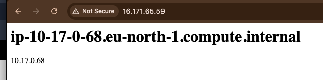

Страница `web-server` в браузере: имя сервера и его приватный адрес `10.17.0.68` из подсети `10.17.0.0/24`.

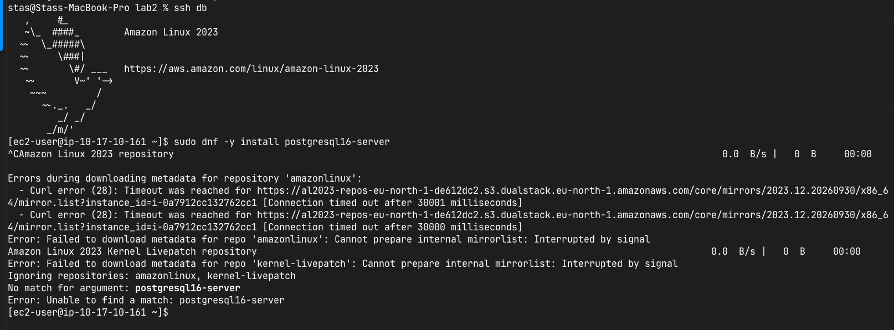

На `db-server` (подключение `ssh db` через bastion) установка `postgresql16-server` зависает: репозиторий недоступен, после `Ctrl+C` ошибки таймаута.

**Почему `db-server` не может скачать пакеты, хотя `web-server` это делает? Что нужно добавить в сеть, чтобы это стало возможно, и при этом `db-server` остался недоступным из интернета?**
У `web-server` есть публичный адрес и маршрут в Internet Gateway, а `db-server` стоит в приватной подсети без публичного адреса и без маршрута наружу. Нужен NAT Gateway в публичной подсети и маршрут `0.0.0.0/0` на него в `private-rt`. NAT пропускает только исходящие соединения, а входящие из интернета не принимает, поэтому база остаётся недоступной снаружи.

### Задание 6. Временный NAT Gateway

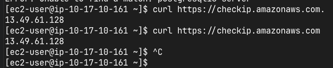

`curl https://checkip.amazonaws.com` на `db-server` при работающем NAT Gateway вернул `13.49.61.128`.

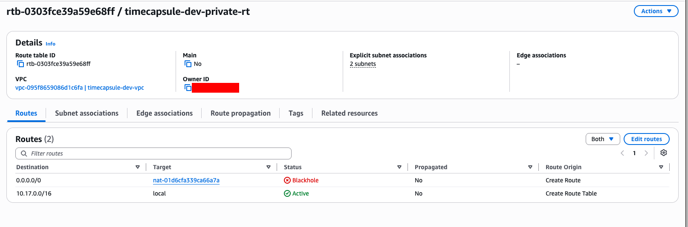

После удаления NAT Gateway маршрут `0.0.0.0/0` в `private-rt` стал `Blackhole`.

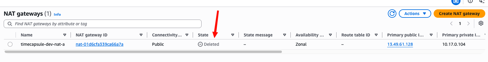

Список NAT gateways: `timecapsule-dev-nat-a` в состоянии `Deleted`, его бывший публичный адрес `13.49.61.128`.

**Какой адрес вернула первая команда? Сравните его с Elastic IP NAT Gateway. Почему это не адрес `db-server`?**
Команда вернула `13.49.61.128`, это и есть Elastic IP NAT Gateway. У `db-server` нет публичного адреса, поэтому NAT подменяет адрес отправителя на свой Elastic IP. Все серверы приватной подсети выходят в интернет под одним общим внешним адресом.

**Доступ к базе ограничивают три механизма: отсутствие публичного адреса и маршрута, Security Group `db-sg` и `pg_hba.conf`. Что делает каждый из них? Что произойдёт, если ошибиться только в одном?**
Отсутствие адреса и маршрута делает базу недостижимой из интернета на уровне сети. `db-sg` пропускает порт 5432 только от `web-sg`, а `pg_hba.conf` решает на уровне PostgreSQL, какому пользователю и откуда можно войти в какую базу. Если ошибиться в одном механизме (например, открыть 5432 для всех в `db-sg`), оставшиеся два всё равно защитят базу: из интернета не будет пути, а вход ограничит `pg_hba.conf`.

**Почему PostgreSQL продолжает работать после удаления NAT Gateway? Что придётся сделать, когда на `db-server` понадобится установить обновления безопасности?**
NAT нужен только для исходящего доступа к репозиториям при установке пакетов. Уже установленный PostgreSQL работает локально и во внешней сети не нуждается. Для обновлений безопасности придётся снова временно поднять NAT Gateway (`nat-up.sh`), установить обновления и удалить его (`nat-down.sh`).

### Задание 7. Проверки

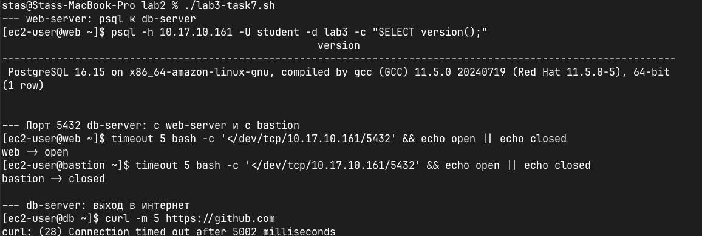

`psql` с `web-server` к `db-server` вернул версию PostgreSQL 16.15. Порт 5432 с `web-server` открыт, с `bastion` закрыт. С `db-server` запрос `curl -m 5 https://github.com` завершился таймаутом.

**Почему с `web-server` порт открыт, а с `bastion` нет, хотя оба сервера в одной VPC и маршрут между ними есть?**
Маршрут `local` есть, но его недостаточно: порт 5432 фильтрует Security Group `db-sg`, а она пропускает только трафик от `web-sg`. У bastion другая группа (`bastion-sg`), поэтому пакеты на порт 5432 отбрасываются.

**Почему запрос не проходит? Можно ли из интернета подключиться к порту 5432 `db-server`? Объясните по цепочке из лекции: маршрут, адрес, фильтры.**
Запрос не проходит, потому что у `db-server` нет маршрута в интернет (в `private-rt` только `local`) и нет публичного адреса, которому шлюз мог бы заменить приватный. Из интернета подключиться к порту 5432 нельзя: нет маршрута до подсети, нет публичного адреса, а за ними стоят ещё два фильтра, `db-sg` и `pg_hba.conf`.

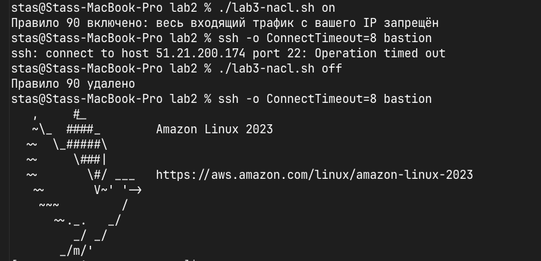

Правило 90 (Deny, весь трафик с моего IP) включено: `ssh bastion` завершается `Operation timed out`. После удаления правила SSH снова работает.

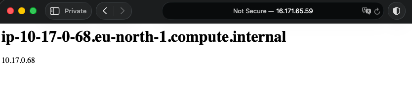

Сайт открывается из другого браузера через VPN, то есть с другого внешнего адреса: запрет на мой обычный IP на него не действует.

**Почему заблокировано и SSH, и сайт, хотя вы не меняли ни одной Security Group? Почему с телефона сайт открывается? Почему правило должно иметь номер меньше 100?**
Network ACL фильтрует трафик на границе подсети, раньше, чем он дойдёт до Security Group, и правило 90 запрещает весь входящий трафик с моего адреса, поэтому закрываются и SSH, и HTTP. С телефона в мобильной сети или через VPN внешний адрес другой, поэтому запрет на него не действует. Правила ACL проверяются по возрастанию номера, и применяется первое подошедшее. Правило 100 разрешает весь трафик, поэтому запрет с большим номером никогда бы не сработал.

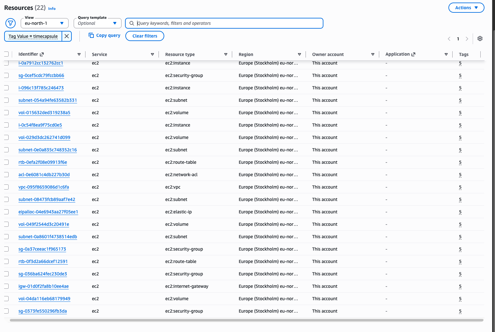

Tag Editor: все 22 ресурса с тегом `Project` = `timecapsule` (VPC, подсети, Internet Gateway, таблицы маршрутов, Security Group, Network ACL, три экземпляра с дисками и Elastic IP).

**Как по тегам найти все ресурсы, которые нужно удалить после окончания проекта? Зачем нужен тег `Owner`, если аккаунт у вас личный?**
В Tag Editor достаточно отфильтровать ресурсы по `Project` = `timecapsule` (и при необходимости по `Lab`) и получить полный список для удаления. Тег `Owner` нужен для привычки и единого соглашения: в рабочем аккаунте с десятками людей по нему видно, кого спросить о ресурсе и на кого отнести расходы.

## Продвинутый уровень

### Задание 8. Перенос сервера ЛР2 в новую сеть

Образ `timecapsule-dev-app-lab2` создан из остановленного сервера ЛР2, из него запущен `app-server` (`timecapsule-dev-app`) в подсети `public-a` с группой `web-sg`. Старый `web-server` из части 1 завершён.

**Что содержит образ? Какие данные из ЛР2 оказались на `app-server` без всякой установки? Где сейчас хранится база данных приложения?**
Образ - это снимок дисков экземпляра вместе с описанием, из которого можно запускать новые серверы с тем же содержимым. На `app-server` без установки оказались nginx, PHP-FPM, приложение в `/var/www/timecapsule` вместе с `.env`, локальная база PostgreSQL с данными, загруженные файлы в `storage/uploads` и скрипт `deploy.sh`. На этом шаге база данных ещё хранится локально на `app-server`, на `db-server` она переедет в задании 12.

### Задание 9. Elastic IP

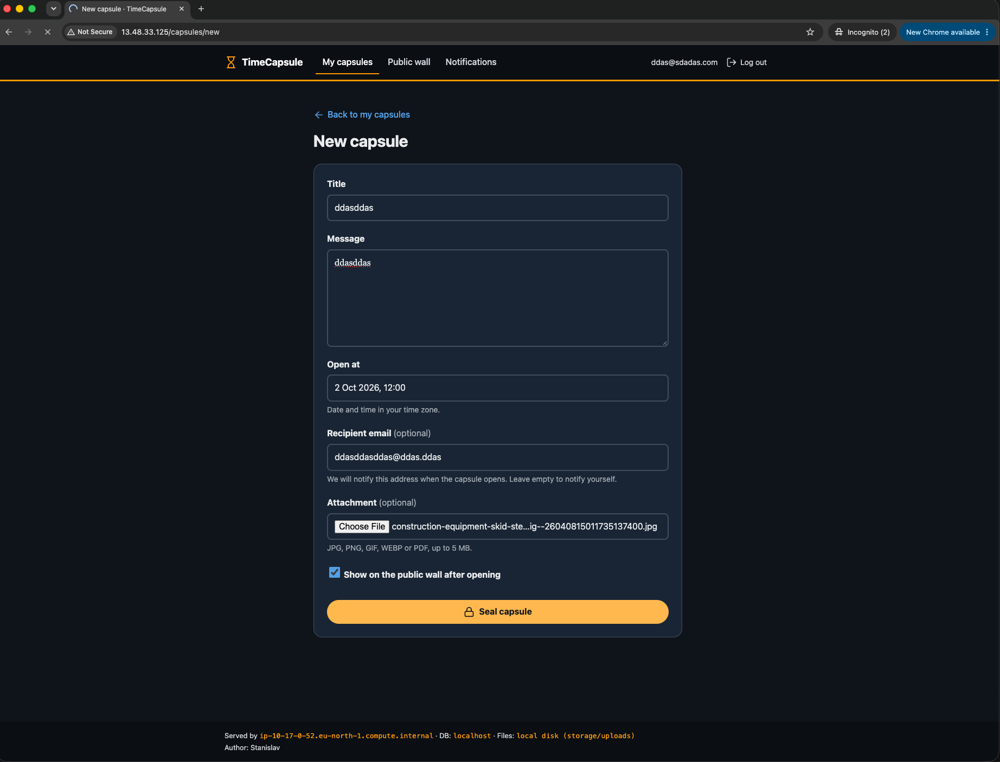

Приложение открыто по Elastic IP `13.48.33.125`. Подвал показывает, что сервер использует `DB: localhost` (база ещё локальная).

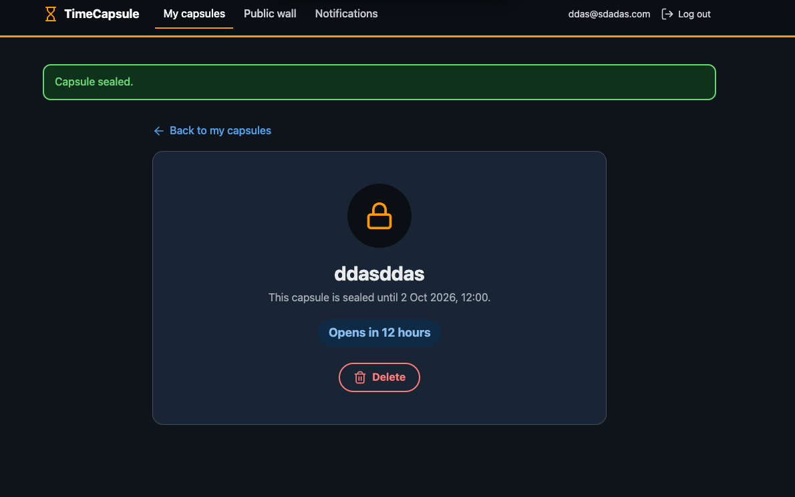

Создана капсула с вложением, она должна пережить перенос базы.

**Почему Elastic IP нужен `app-server`, но не нужен bastion? Сколько стоит Elastic IP, пока сервер остановлен, и почему? Когда в следующих работах перед сервером появится балансировщик нагрузки, понадобится ли Elastic IP?**
Пользователи заходят на `app-server` по постоянному адресу (`APP_URL`, закладки), а bastion - служебный сервер, его адрес меняется, и достаточно обновить строку `HostName` в `~/.ssh/config`. Elastic IP стоит около $0,005 в час всегда, даже у остановленного сервера, потому что адрес остаётся зарезервированным за аккаунтом. С балансировщиком Elastic IP на `app-server` не понадобится: пользователи будут приходить на DNS-имя балансировщика.

### Задание 10. База данных приложения на `db-server`

На `db-server` создан пользователь `timecapsule` с новым паролем и база `timecapsule`. Строка в `pg_hba.conf` сужена до `host timecapsule timecapsule 10.17.0.0/24 scram-sha-256`.

**Зачем для базы в отдельной сети нужен новый сильный пароль, если порт 5432 и так закрыт Security Group?**
Security Group - один из слоёв защиты, и её можно случайно изменить или обойти через уже скомпрометированный сервер из `web-sg`, которому порт открыт. Пароль не даёт войти в базу тому, у кого есть только сетевой доступ. Новый уникальный пароль нужен ещё и потому, что старый из ЛР2 мог оказаться в логах и на скриншотах.

### Задание 11. Приватная зона Route 53

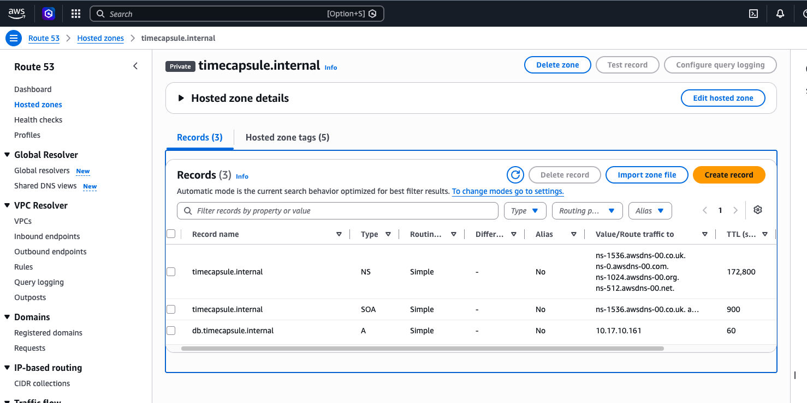

Приватная зона `timecapsule.internal`: запись `db.timecapsule.internal`, тип A, значение `10.17.10.161`, TTL 60.

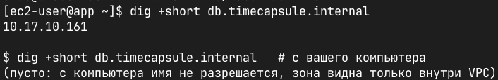

`dig +short db.timecapsule.internal` с `app-server` возвращает `10.17.10.161`, с моего компьютера ответа нет.

**Почему с `app-server` имя находится, а с вашего компьютера нет? Что придётся изменить, если `db-server` пересоздадут с другим адресом?**
Приватная зона связана только с `timecapsule-dev-vpc` и отвечает на запросы, которые приходят из этой сети через DNS-сервер VPC. Запрос с моего компьютера уходит на публичные DNS-серверы, где такой зоны нет. Если `db-server` пересоздадут с другим адресом, достаточно изменить значение одной A-записи `db`, а `.env` приложения менять не нужно.

### Задание 12. Перенос данных и переключение приложения

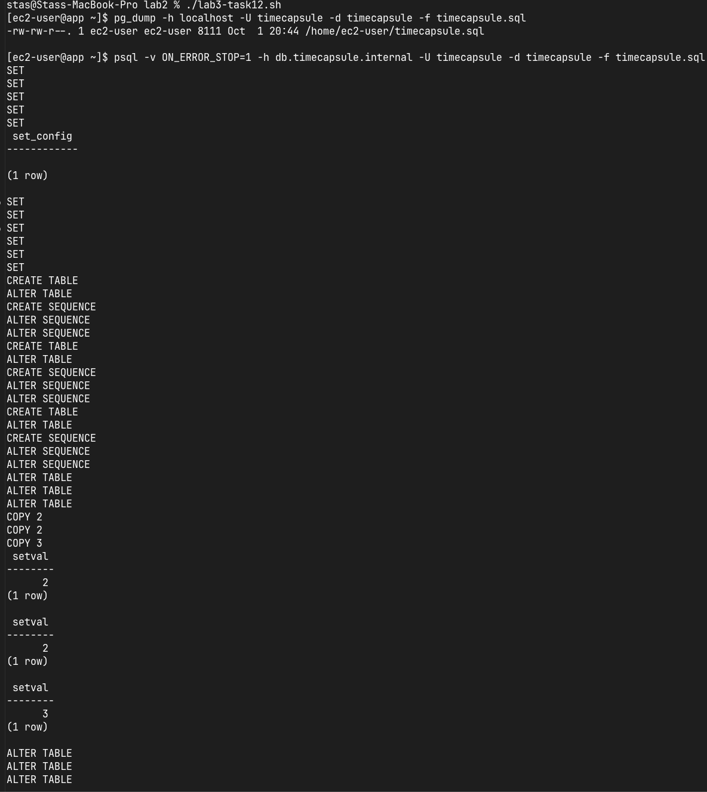

`pg_dump` локальной базы на `app-server` и загрузка `psql -f` в `db.timecapsule.internal`: создание таблиц и последовательностей, `COPY 2`, `COPY 2`, `COPY 3`.

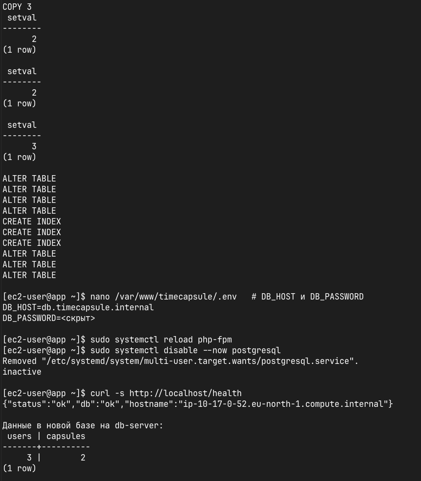

Замена `DB_HOST` на `db.timecapsule.internal`, `reload php-fpm`, локальный PostgreSQL отключён (`inactive`), `/health` отвечает `ok`, в новой базе 3 пользователя и 2 капсулы.

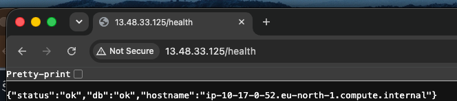

`http://13.48.33.125/health`: `{"status":"ok","db":"ok",...}`.

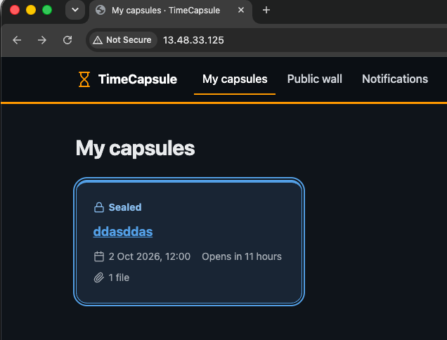

Главная страница после переключения на базу `db-server`: капсула с вложением, созданная до переноса, на месте.

Образ `timecapsule-dev-app-lab2` и его снимок после проверки удалены.

**Файлы, которые пользователи прикрепили к капсулам, переехали вместе с образом, а не вместе с базой. Где они лежат? Что с ними будет, если `app-server` удалить?**
Файлы лежат в `/var/www/timecapsule/storage/uploads` на корневом диске EBS `app-server`. Если `app-server` завершить (`Terminate`), этот диск удалится вместе с экземпляром, файлы пропадут, а записи в базе будут ссылаться на несуществующие вложения. Нужны снимки диска или хранение файлов в отдельном сервисе, например S3.

### Задание 13. Деплой и обслуживание

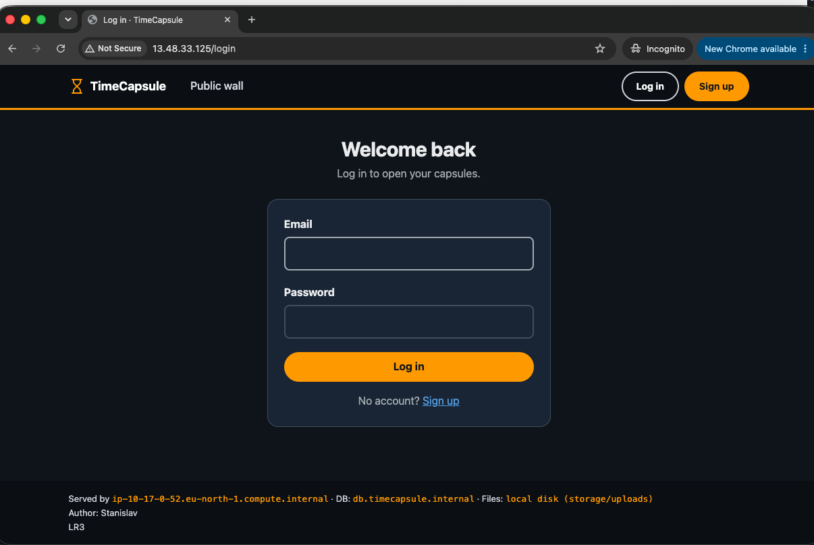

Новая версия выложена командой `ssh app ./deploy.sh`. В подвале появилась строка `LR3`, а `DB: db.timecapsule.internal` показывает, что приложение работает с новой базой.

**Почему в самом `deploy.sh` (или в командах варианта A) ничего менять не пришлось?**
Скрипт описывает шаги деплоя на самом сервере: `git pull`, `composer install`, `init-db.php`, `reload php-fpm`. Как до сервера добраться и где находится база, определяют `~/.ssh/config` (хост `app` с `ProxyJump bastion`) и `.env` (`DB_HOST=db.timecapsule.internal`). Изменилась сеть вокруг приложения, а сами шаги выпуска остались прежними.

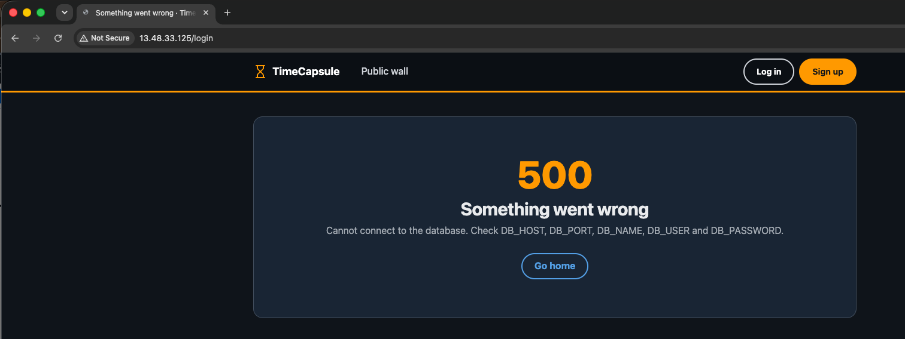

При остановленном `db-server` страница отвечает `500`: «Cannot connect to the database».

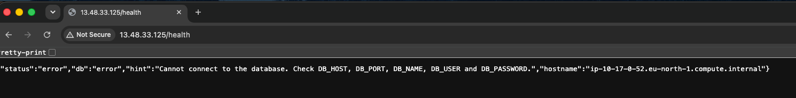

`/health` при остановленной базе: `"status":"error","db":"error"` с подсказкой проверить `DB_HOST`, `DB_PASSWORD` и другие параметры.

**Что показал `/health` и почему? Изменился ли приватный адрес `db-server` после остановки и запуска?**
`/health` вернул ошибку, потому что запрос к базе (`SELECT COUNT(*) FROM users`) не прошёл: сервер базы был выключен. После запуска `db-server` приложение заработало само, без правок на `app-server`. Приватный адрес `db-server` не изменился (`10.17.10.161`): приватный адрес сохраняется при остановке и запуске, меняется только автоматически выданный публичный.

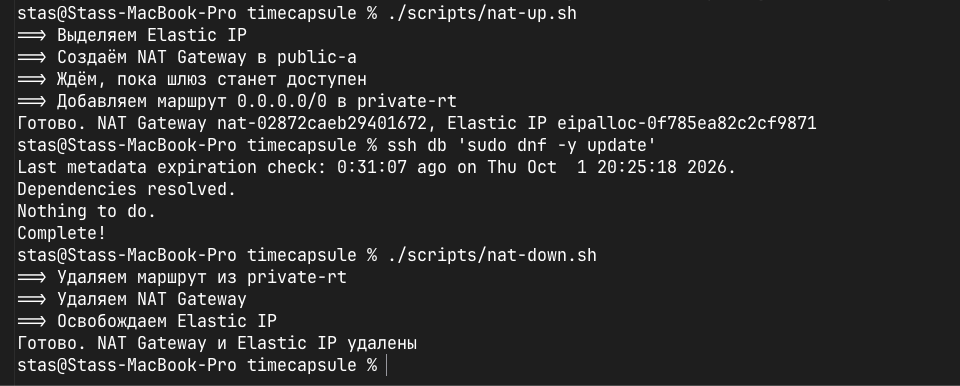

Вариант B: `nat-up.sh` создаёт Elastic IP, NAT Gateway и маршрут, `sudo dnf -y update` на `db-server` проходит (новых обновлений нет), `nat-down.sh` удаляет маршрут, NAT Gateway и освобождает Elastic IP.

**Почему `nat-down.sh` должен освобождать Elastic IP только после того, как NAT Gateway удалён?**
Пока NAT Gateway существует, Elastic IP привязан к нему, и AWS не даст освободить адрес. Освободить его можно только после полного удаления шлюза, поэтому скрипт сначала ждёт состояния `deleted` и только потом вызывает `release-address`, делая несколько попыток.

### Задание 14. Архитектура и решение

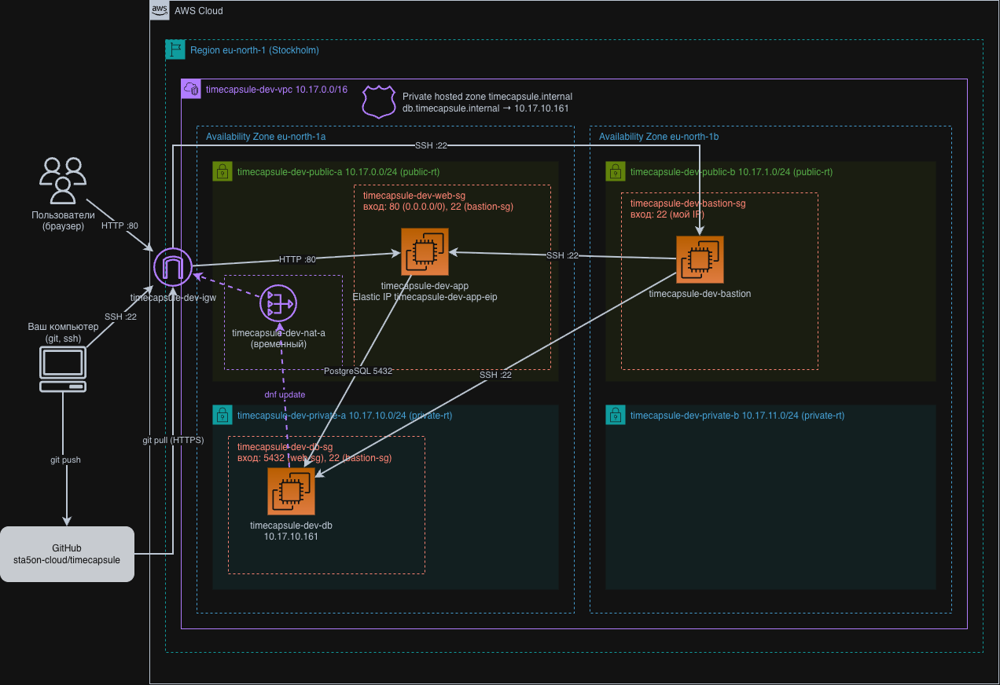

Схема сети: пользователи, мой компьютер и GitHub вне AWS; AWS Cloud, регион `eu-north-1` и `timecapsule-dev-vpc`; две зоны доступности и четыре подсети; Internet Gateway; три сервера со своими Security Group; приватная зона Route 53; временный NAT Gateway (пунктиром).

Архитектурное решение: [ADR-0002. Размещение базы данных](../adr/0002-database-placement.md).

## Итог

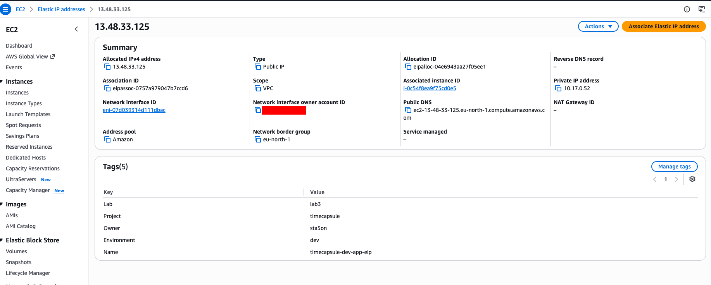

После остановки серверов остался единственный Elastic IP `13.48.33.125` (`timecapsule-dev-app-eip`), привязанный к `app-server`.

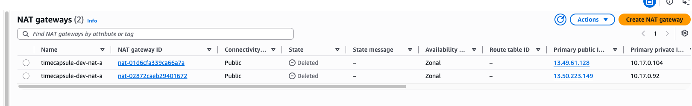

Оба NAT Gateway (из задания 6 и из задания 13) в состоянии `Deleted`, работающих шлюзов нет.

## Устные вопросы

**1. Как проходит запрос пользователя от браузера до базы данных? Какие маршруты и какие правила фильтрации он проходит на каждом шаге?**
Запрос приходит на Internet Gateway по маршруту `0.0.0.0/0 → igw` в `public-rt`, затем проходит Network ACL подсети `public-a` и Security Group `web-sg` (порт 80 открыт для всех) и попадает в nginx и PHP-FPM на `app-server`. Приложение узнаёт адрес базы у DNS VPC (`db.timecapsule.internal → 10.17.10.161`) и идёт к нему по локальному маршруту `10.17.0.0/16`. В `private-a` его проверяют Network ACL, `db-sg` (порт 5432 только от `web-sg`) и `pg_hba.conf` (пользователь `timecapsule`, база `timecapsule`, подсеть `public-a`).

**2. Злоумышленник знает приватный IP `db-server`. Что ему нужно получить, чтобы подключиться к базе?**
Сам по себе приватный адрес бесполезен: он не маршрутизируется из интернета. Нужно сначала оказаться внутри VPC на сервере с группой `web-sg` (например, взломав `app-server`), а затем знать пользователя и пароль `timecapsule`. Источник подключения должен быть из подсети `public-a`, как требует `pg_hba.conf`.

**3. Чем временный NAT Gateway лучше постоянного, и какие неудобства он создаёт?**
Временный NAT стоит копейки, а забытый постоянный около $1,25 в сутки, и в остальное время у `db-server` нет выхода в интернет, то есть меньше поверхность атаки. Неудобство в том, что перед каждым обновлением его нужно поднимать (около двух минут) и потом не забыть удалить вместе с Elastic IP. Скрипты `nat-up.sh` и `nat-down.sh` делают это повторяемо.

**4. Как изменится схема, если приложение должно пережить отказ зоны `eu-north-1a`? Каких ресурсов для этого не хватает?**
Сейчас в зоне `a` стоят и `app-server`, и `db-server`, поэтому отказ зоны остановит всё приложение. Нужен второй сервер приложения в зоне `b` и балансировщик нагрузки на обе зоны, реплика базы в `private-b` (или управляемая база с несколькими зонами) с переключением, а также NAT Gateway в каждой зоне для обновлений. Bastion уже стоит в зоне `b`.
